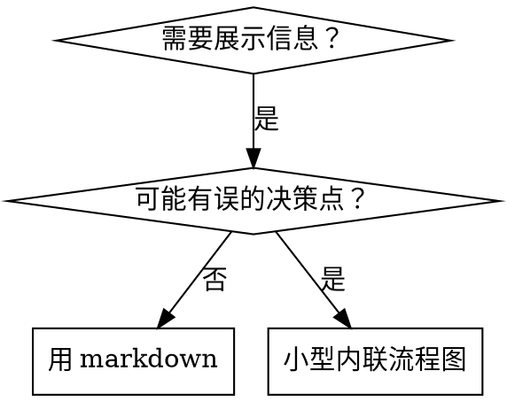

# 编写技能

## 概述

**编写技能是为代理编写可发现、可执行、可遵从的参考指南。**

技能的好坏取决于三点：代理能否**找到**它（CSO）、能否**理解**它（结构）、能否**遵从**它（清晰）。

**验证思维**：借鉴 TDD——先想清楚代理在没有这个技能时会怎么失败，再写最简的指导。本技能的主流程是代理可直接执行的实操指南；完整 TDD subagent 压力测试作为**人类作者参考**见[L5]。

**核心原则：** 如果你没想过 agent 在无技能时会如何失败，你就不知道技能是否教会了正确的东西。

**技能的作用域**：技能可以放在项目级（仓库内 `skills/` 或 `.claude/skills/`）或个人级（`~/.claude/skills/`、`~/.agents/skills/`）。见下方 [作用域选择](#作用域选择)。

**官方指导：** Anthropic 官方的技能编写最佳实践见[L1]。本文档提供补充的模式和指南。

---

## 前置 Skill

**必须先激活 [`writing-agent-docs`](../writing-agent-docs/SKILL.md)——禁止以任何理由绕过此步骤。** 代理文档写作的通用规则。本技能仅承载 SKILL.md 专属内容（技能类型、CSO、三级渐进式披露、反模式、自检），不重复通用规则。

---

## 什么是技能？

**技能** 是经过验证的技术、模式或工具的参考指南。技能帮助未来的代理实例发现并应用有效的方法。

**技能是：** 可复用的技术、模式、工具、参考指南

**技能不是：** 关于你如何一次性解决某个问题的叙述

## 何时创建技能

**创建时机：**

- 技术对你来说并非直观易懂
- 你会跨项目再次参考它
- 模式适用范围广（非项目专属）
- 他人会受益

**不要创建：**

- 一次性解决方案
- 其他地方已有完善文档的标准实践
- 项目专属约定（放入项目级 AGENTS.md / CLAUDE.md）
- 机械性约束（如果可用正则/验证强制实施，就自动化它——把文档留给需要判断的情况）

## 作用域选择

技能可以放在项目级或个人级目录，SKILL.md 格式不变，但存放位置决定谁能用它：

| 作用域 | 放置位置 | 谁可见 |
|--------|---------|--------|
| **项目级** | 仓库内 `.claude/skills/`、`.cursor/skills/`、`skills/` 等 | 在此仓库工作的代理 |
| **个人级** | `~/.claude/skills/`、`~/.agents/skills/`、`~/.cursor/skills/` | 你所有的代理会话 |

### 选择指南

- 技能与特定项目相关（项目特有工具链、部署流程）→ **项目级**
- 技能跨项目通用（语言最佳实践、调试方法论）→ **个人级**
- 技能是你个人工作流的一部分（提交规范、代码审查流程）→ **个人级**
- 不确定时 → 先从个人级开始，需要时再搬到项目级

### 加载差异

项目级技能仅在代理进入该项目时可见；个人级技能在所有会话中可见。
两者在技能发现上无优先级差异——匹配 description 时都会被搜索到。

## 技能类型

### 技术型

有步骤可循的具体方法（condition-based-waiting、root-cause-tracing）

### 模式型

思考问题的方式（flatten-with-flags、test-invariants）

### 参考型

API 文档、语法指南、工具文档（office docs）

## 目录结构与文件组织

遵循 [R1] 与 [R2]：

```
skill-name/
├── SKILL.md          # 必需：元数据 + 指令（<500 行）
├── references/       # 代理按需加载的文档
├── scripts/          # 可执行代码
├── assets/           # 静态资源（模板、字体、图标）
└── authoring/        # 人类作者参考（代理常规任务不加载——本仓库补充）
```

**子目录用途：**

| 目录 | 内容 | 加载时机 |
|---|---|---|
| `references/` | 详细参考、外部权威转载、按域/框架拆分的指南 | 代理任务中按需加载 |
| `scripts/` | 可执行代码（确定性/重复性任务） | 执行时不进入上下文 |
| `assets/` | 输出用静态文件（模板、字体、图标） | 嵌入输出时读取 |
| `authoring/` | 仅供人类作者参考的内容（如 TDD 验证流程） | 代理常规任务不加载 |

所有目录可选，仅在提供明确价值时添加。`authoring/` 是本仓库补充——官方标准未覆盖“代理常规任务不加载”这一类别。

**分类标准是加载时机，不是内容来源**——`references/` 收纳所有代理按需加载的文档，不区分自撰参考与外部转载。不确定时参考 [R3] 仓库的实际组织。

**子目录分类指导**：

- **按主题/领域分**：参考文件多且有自然主题层次时，在 `references/` 内部按主题分子目录（官方 [R2]），如 `references/core/`、`references/extensions/`。
- **纯参考型例外**：若 SKILL.md 为索引、主体全是参考文档，主题目录可直接做顶层（如 `memo/`、`ext/`），不强制套 `references/`。
- **不要按内容来源分**：无论放顶层还是 `references/` 内，分类维度是主题/领域，不是来源（自撰 vs 转载）。

**官方未覆盖的边界**（如 Gherkin 测试规格、示例数据）：可建自定义目录（如 `test/`、`samples/`），在 SKILL.md 中明确说明其用途与加载时机。官方约定是起点，不是终点。

**归置优先级**——内容先就地或归入当前文件的其它相关章节（非索引类），就近归并、免一次加载跳转；同文件无合适归处、或属下列类型时才下沉子文件。

**何时分离到子文件：**

1. **重量级参考**（100 行以上）→ `references/`
2. **可复用工具 / 脚本** → `scripts/`
3. **静态资源** → `assets/`

**保持内联：** 原则和概念、代码模式（50 行以内）、其他所有内容。

**引用保持一层深度**——代理从 SKILL.md 到目标文件的引用链不超过 1 跳
（如 `SKILL.md → references/foo.md` 可以，应避免 `→ references/sub/foo.md → bar.md`）。
文件系统路径深度（如 `memo/subtopic/foo.md`）**不影响**引用链长度。
嵌套引用会导致代理用 `head` 预览，信息不完整。

### 组织模式

- **自包含**——所有内容内联于 SKILL.md（适用：无需重量级参考）。
- **带参考文档**——SKILL.md（概述 + 工作流）+ `references/`（按需加载的详细参考）。
- **索引型（纯参考）**——SKILL.md 为索引，参考文档按主题分目录存放（`memo/`、`ext/` 等）。参考文件多、需要按主题导航时适用。
- **带可复用工具**——在上述任一模式基础上增加 `scripts/`（可执行辅助代码）或 `assets/`（输出用资源）。

### 技能组合（Skill Bundles）

多个技能需协同工作时可用 **Skill Bundle** 模式——清单文件将多技能组合成逻辑单元，单条命令批量加载。
支持工具：Hermes Agent（YAML 文件 `~/.hermes/skill-bundles/`）、Claude Code（Dynamic Workflow 编排）。
适用：技能组经常同时加载、多步骤工作流需确定性顺序、分发 onboarding 包。
**注意**：Bundle 是工具特定功能，尚无跨工具标准；写跨工具技能时保持每个 SKILL.md 独立可用。

## SKILL.md 结构

**前置元数据（YAML）：**

所有字段中，开放标准字段（[R1]）跨平台通用，Claude Code 特有字段仅该平台支持。`name` 和 `description` 在开放标准中为**必需**，Claude Code 中 `name` 默认为目录名（可选）、`description` 为推荐。

**必需字段（开放标准）：**

| 字段 | 约束 |
|------|------|
| `name` | ≤64 字符，仅小写字母/数字/连字符；不得连续连字符 `--`、首尾连字符、含保留词 `anthropic`/`claude`；**必须与父目录名一致**；推荐动名词形式如 `processing-pdfs`；避免模糊命名如 `helper`、`utils` |
| `description` | ≤1024 字符、非空、不得含 XML 标签；第三人称、描述做什么 + 何时使用、绝不总结工作流（见 [CSO](#技能搜索优化cso)） |

**可选字段（开放标准 — agentskills.io）：**

| 字段 | 说明 |
|------|------|
| `license` | 许可证名称或引用许可证文件 |
| `compatibility` | ≤500 字符，环境/工具要求 |
| `metadata` | 任意键值对，用于附加元数据 |
| `allowed-tools` | ⚗️ 预批准的工具白名单，空格分隔，各实现支持程度不同 |
| `prerequisite-skills` | 🧪 **提案中**（[R13]）——技能执行前建议先加载的依赖技能列表，含 `slug` 和可选 `reason` |
| `related-skills` | 🧪 **提案中**（[R13]）——与本技能配合使用的互补技能列表，含 `slug` 和可选 `reason` |

**Claude Code 平台特有字段：**

| 字段 | 说明 |
|------|------|
| `when_to_use` | 额外触发条件/示例请求，追加到 description，共享 1536 字符上限 |
| `argument-hint` | 自动补全时显示的参数提示（如 `[issue-number]`） |
| `arguments` | 命名位置参数，供 `$name` 替换，空格分隔或 YAML 列表 |
| `disable-model-invocation` | `true` 阻止自动加载，仅手动 `/name` 触发，同时阻止 subagent 预加载 |
| `user-invocable` | `false` 从 `/` 菜单隐藏，作背景知识 |
| `disallowed-tools` | 技能激活期间从代理工具池移除的工具列表 |
| `model` | 覆盖当前 turn 使用的模型，下一轮恢复会话模型 |
| `effort` | 覆盖会话 effort（`low`/`medium`/`high`/`xhigh`/`max`） |
| `context` | 设为 `fork` 时在隔离 subagent 中运行技能 |
| `agent` | `context: fork` 时指定 subagent 类型（`Explore`/`Plan`/`general-purpose` 或自定义） |
| `paths` | **Glob 模式** — 限制技能自动激活的文件范围，逗号分隔或 YAML 列表 |
| `shell` | `!`command`` 代码块的 shell（`bash`/`powershell`，需 `CLAUDE_CODE_USE_POWERSHELL_TOOL=1`） |
| `hooks` | 技能生命周期钩子 |

**主体大小**：SKILL.md body 保持 <500 行 / **指令 < 5000 tokens**（agentskills.io 推荐预算）；接近上限时拆分到参考文件（超 100 行的参考文件加目录）。

**description 长度指引**：字段上限 1024 字符。建议目标不超过 **200 字符**——短描述在技能索引中更易被代理快速扫描。（Hermes Agent 另有 ≤60 字符的推荐，属工具特有标准。）

```markdown
---
name: Skill-Name-With-Hyphens
description: [做什么]. 在以下情况使用：[具体触发条件和症状]
---

# 技能名称

## 概述
这是什么？核心原则一两句话。

## 何时使用
[如果决策不明显可加小型内联流程图]

带有症状和用例的列表
何时不使用

## 核心模式（针对技术/模式型）
改进前后的代码对比

## 快速参考
便于扫描常用操作的表格或列表——对比信息优先用表格而非纯 bullet list（writing-agent-docs 原则 C.4）

## 实现
简单模式用内联代码
重量级参考或可复用工具用文件链接

## 常见错误
什么会出错 + 如何修复

## 实际效果（可选）
具体结果
```

## 技能搜索优化（CSO）

**对发现性至关重要：** 未来的代理通过读取 description 决定是否加载你的技能。

**核心原则：描述 = 做什么 + 何时使用，绝不总结工作流。**

- 前半句说明技能功能（做什么），后半句聚焦触发条件与症状（何时使用）
  - 模式：`[做什么]. Use when [触发条件].` 或 `[做什么]. [触发条件时] 使用。`
- **重点放在“何时使用”上**——“做什么”只需一句话界定功能范畴；“何时使用”应包含具体症状、触发条件和典型场景。搜索匹配主要靠症状，功能概述仅用于确认边界。
- **“做什么”是功能概述，不是步骤列举**——“从 PDF 提取文本”是功能，“用 pdfplumber 打开、读取、提取”是工作流
- **绝不总结技能的过程或工作流**——测试发现，描述若总结工作流，代理会只跟随描述而跳过技能主体
- 第三人称、含具体症状、与技术无关（除非技能本身技术特定）
- **含否定触发条件**：明确说明技能不适用场景（“不要用于 Vue 项目”——[R7]），减少误触发。否定条件用于边界界定而非行为禁令，与 description 的触发匹配语义一致

最简好坏对照：

```yaml
# 坏：总结了工作流——代理可能跟随它而非阅读技能
description: 在执行计划时使用——按任务分发 subagent，任务间进行代码审查
# 好：功能 + 触发条件，无工作流总结
description: 协调多个 subagent 执行跨任务实施计划。在当前会话中涉及多个独立任务时使用。
```

关键词覆盖、描述性命名、Token 效率目标、交叉引用其他技能的完整规则与好坏示例见 [L2]。

## 流程图使用



**仅在这些场景使用流程图：**

- 非显而易见的决策点
- 你可能过早停止的流程循环
- “何时用 A vs B” 的决策

**绝不在以下场景使用流程图：**

- 参考材料 → 表格、列表
- 代码示例 → Markdown 代码块
- 线性指令 → 编号列表
- 无语义含义的标签（step1、helper2）

Graphviz 样式规则见 [graphviz-conventions.dot](./references/graphviz-conventions.dot)。

**为人类伙伴可视化：** 使用 `scripts/render-graphs.js` 将技能的流程图渲染为 SVG：

```bash
./scripts/render-graphs.js ../some-skill           # 分别渲染每个图示
./scripts/render-graphs.js ../some-skill --combine # 将所有图示合并为一张 SVG
```

## 代码示例

技能专属补充：

选择最相关的语言：

- 测试技术 → TypeScript/JavaScript
- 系统调试 → Shell/Python
- 数据处理 → Python

你很擅长移植——一个好的示例就足够了。

> **示例用真实值**：技能中的代码示例必须用项目真实数据而非占位符（`"string"`、`"YOUR_VALUE"`）——代理会字面复制占位字符串（writing-agent-docs 原则 B.3）。

## 反模式

### 叙述性示例

“在 2025-10-03 的会话中，我们发现空的 projectDir 导致……”
**为什么不好：** 过于具体，不可复用

### 代码写入流程图

```dot
step1 [label="import fs"];
step2 [label="read file"];
```

**为什么不好：** 无法复制粘贴，难以阅读

### 通用标签

helper1、helper2、step3、pattern4
**为什么不好：** 标签应有语义含义

## 安全考虑

技能直接注入代理上下文，恶意或脆弱的技能可导致数据窃取、权限提升等风险。证据链（漏洞发现 → 产业审计 → 可利用性验证 → 供应链投毒 → 扫描器绕过实证 → 真实攻击验证 → 行业安全标准）见 [security.md](./references/security.md)。

> **2026 关键更新**：安全研究已证实主流技能扫描器均可被绕过（CSA, Trail of Bits），且已有虚假技能绕过所有检测、触及 26,000 个 agent 的真实攻击（AIR）。OWASP 发布 **Agentic Skills Top 10（AST10）** 行业安全标准。详见 [security.md](./references/security.md)。

### 编写安全——摘要

- **凭证与密钥**：不硬编码凭证；description 不暴露敏感信息；环境变量替代硬编码
- **最小权限**：`allowed-tools` 只给最小工具集；结合 OpenCode 权限模式与 Claude Code hooks 纵深防御
- **代码示例与脚本**：公开技能需审计脚本；代码示例不照搬来源不明片段；非可信源技能不自动加载
- **记忆持久化**：技能若写 `SOUL.md`/`MEMORY.md` 等记忆文件，写入内容需审查
- **供应链**：锁定版本（tag/commit SHA）；部署前用 `mcp-scan`（`uvx mcp-scan@latest --skills`）扫描
- **扫描器盲区**：自动扫描是必经检查点，但不是最终安全保证——[security.md](./references/security.md) 详述盲区类型与应对策略

**完整的安全注意事项、扩展风险场景（供应链、记忆投毒、扫描器盲区、市场风险、OWASP Top 10）与发现即检查清单见 [security.md](./references/security.md)。**

## 验证与自检

**核心原则：未经验证的技能 = 未经验证的代码。** 但验证强度因技能类型而异，代理可执行的自检是所有类型的基础。

> 常规自检项已整合进下方的 [技能创建清单](#技能创建清单)（编写后阶段），此处不重复。

### 验证强度分类型

| 技能类型 | 最低验证（代理可执行） | 深度验证（人类作者） |
|---------|---------------------|-------------------|
| **纪律执行型** | 自检 + 对照合理化借口表 | **完整 TDD**：先跑基线压力测试，再写技能，封堵漏洞 |
| **技术型** | 自检 + 应用场景走查 | 应用场景测试 + 边界测试 |
| **模式型** | 自检 + 反例走查 | 识别测试 + 应用测试 |
| **参考型** | 自检 + 检索走查（常用场景能否找到） | 检索测试 + 缺口测试 |

**深度验证方法**（人类作者）见[L5]。

## 技能创建清单

**重要：使用 TodoWrite 为下方每个清单项创建待办事项。**

**编写前——确认该不该建：**

- [ ] 技术非直观、会跨项目复用、适用范围广（非项目专属）
- [ ] 不是一次性方案、不是已有完善文档的标准实践、不是项目专属约定

**编写中——结构与内容：**

- [ ] 名称仅用小写字母、数字、连字符（无连续/首尾连字符，与父目录名一致，≤64 字符）；推荐**动名词形式**（`processing-pdfs`）
- [ ] YAML 前置元数据含必需的 `name`（≤64）和 `description`（≤1024）字段；可选字段视需要添加（`allowed-tools`、`disable-model-invocation` 等）——见 [R1]
- [ ] description 格式为“做什么 + 何时使用”，未总结工作流
- [ ] description 以第三人称编写，含具体触发条件/症状
- [ ] 全文含搜索关键词（错误、症状、工具）
- [ ] 清晰的概述含核心原则
- [ ] 代码内联或链接到单独文件
- [ ] 一个优秀的示例（非多语言）
- [ ] 仅在决策不明显时使用小型流程图
- [ ] 快速参考表
- [ ] 常见错误章节

**编写后——自检验证：**

- [ ] description 格式为“做什么 + 何时使用”，未总结工作流
- [ ] 全文含搜索关键词（错误信息、症状、工具名）
- [ ] 概述含核心原则，一两句话
- [ ] 代码示例完整可运行，来自真实场景
- [ ] 无叙述性故事、无通用标签、无代码写入流程图
- [ ] 引用保持一层深度（无深层嵌套）
- [ ] body <500 行；超限的参考已拆到单独文件
- [ ] 走查：代理能否找到（CSO）、能否理解（结构）、能否遵从（清晰）
- [ ] 安全检查：无硬编码凭证、`allowed-tools` 最小权限、description 未暴露敏感信息——完整清单见 [security.md](./references/security.md)
- [ ] （纪律执行型）考虑跑基线测试——见[L5]

**部署：**

- [ ] 将技能提交到 git 并推送到你的 fork（如已配置）
- [ ] 考虑通过 PR 贡献回来（如果广泛有用）

## 发现工作流

未来的代理如何找到你的技能：

1. **遇到问题**（“测试不稳定”）
2. **找到技能**（description 匹配）
3. **扫描概述**（这相关吗？）
4. **阅读模式**（快速参考表）
5. **加载示例**（仅在实现时）

**为此流程优化**——尽早且频繁地放置可搜索术语。

---

## 技能生态与发布

生态概况、市场列表、发布流程、SkillsBench 验证数据、跨工具兼容性等参考材料见 [references/ecosystem-publishing.md](./references/ecosystem-publishing.md)。

---

## 参考文献

| 编号 | 链接 | 标题 | 核心内容 |
|------|------|------|---------|
| [R1] | <https://agentskills.io/specification> | Agent Skills Specification | 开放标准规范，定义 SKILL.md 格式与字段 |
| [R2] | <https://anthropics-skills.mintlify.app/creating-skills/bundled-resources> | Creating Skills — Bundled Resources | 资源组织、引用深度、主题分类等官方约定 |
| [R3] | <https://github.com/anthropics/skills> | anthropics/skills | 官方技能参考仓库 |
| [R7] | <https://github.com/mgechev/skills-best-practices> | Skills Best Practices | 否定触发条件、技能验证方法论 |
| [R13] | <https://github.com/agentskills/agentskills/issues/90> | Proposal: Skill Relationship Fields | 提案新增 `prerequisite-skills` 和 `related-skills` 字段到 SKILL.md 规范 |

---

## 本地参考

所有支持文件均直接从本 SKILL.md 链接（一层引用深度）。按目录与加载时机分组：

**`references/`**（代理任务中按需加载）：

| 编号 | 文件 | 用途 |
|------|------|------|
| [L1] | [anthropic-best-practices.md](./references/anthropic-best-practices.md) | Anthropic 官方最佳实践补充（自由度、模型测试、可执行脚本、MCP 引用）|
| [L2] | [claude-search-optimization.md](./references/claude-search-optimization.md) | CSO 完整规则（关键词覆盖、命名、Token 效率、交叉引用）|
| [L3] | [graphviz-conventions.dot](./references/graphviz-conventions.dot) | Graphviz 流程图样式规则 |
| [L9] | [security.md](./references/security.md) | 安全考虑完整参考（证据链、注意事项、扩展风险场景、检查清单）|
| [L11] | [ecosystem-publishing.md](./references/ecosystem-publishing.md) | 技能生态概况：市场分布、发布流程、SkillsBench 验证数据、跨工具兼容性 |

**`scripts/`**（执行时不进入上下文）：

| 编号 | 文件 | 用途 |
|------|------|------|
| [L4] | [render-graphs.js](./scripts/render-graphs.js) | 渲染 SKILL.md 中 dot 代码块为 SVG 的工具（人类可视化辅助）|

**`authoring/`**（人类作者参考，代理常规任务无需加载）：

| 编号 | 文件 | 用途 |
|------|------|------|
| [L5] | [tdd-validation.md](./authoring/tdd-validation.md) | TDD 验证方法（RED-GREEN-REFACTOR、压力场景、铁律）|
| [L6] | [anti-rationalization.md](./authoring/anti-rationalization.md) | 合理化借口对照表、封堵手法、红旗清单模板 |
| [L7] | [persuasion-principles.md](./authoring/persuasion-principles.md) | 技能设计中说服原则的心理学基础（Cialdini 2021; Meincke et al. 2025）|
| [L8] | [tdd-validation-example.md](./authoring/tdd-validation-example.md) | TDD 验证方法完整实战示例（CLAUDE.md 文档变体测试记录） |
| [L10] | [auto-generated-skill-review.md](./authoring/auto-generated-skill-review.md) | 自动生成 SKILL.md 的质量审查清单与优化流程（Hermes `/learn` 等工具适用）|

---
> **人类作者参考：** 完整 TDD 验证方法（TDD 映射、铁律、分类型测试、对抗合理化、RED-GREEN-REFACTOR 循环、压力场景编写）见 **[L5]**。代理在常规任务中无需执行——[技能创建清单 · 编写后](#技能创建清单) 已覆盖基础验证。
