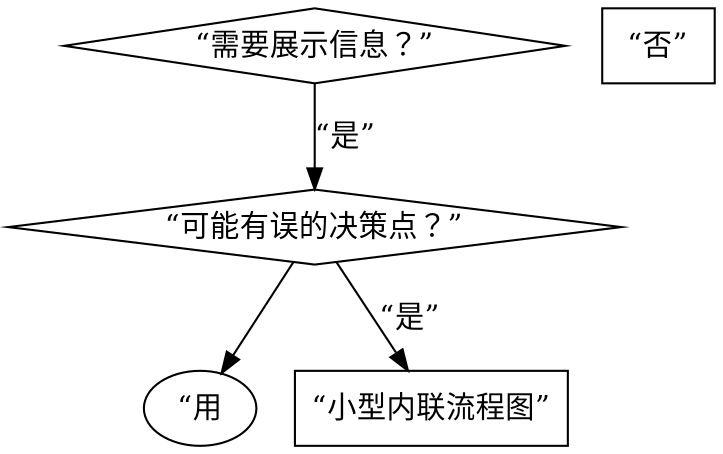

# 编写技能

## 概述

**编写技能是为代理编写可发现、可执行、可遵从的参考指南。**

技能的好坏取决于三点：代理能否**找到**它（CSO）、能否**理解**它（结构）、能否**遵从**它（清晰）。

**验证思维**：借鉴 TDD——先想清楚代理在没有这个技能时会怎么失败，再写最简的指导。本技能的主流程是代理可直接执行的实操指南；完整 TDD subagent 压力测试作为**人类作者参考**见 [tdd-validation.md](./tdd-validation.md)。

**核心原则：** 如果你没想过 agent 在无技能时会如何失败，你就不知道技能是否教会了正确的东西。

**个人技能存放在 agent 专属目录**（Claude Code 用 `~/.claude/skills`，Codex 用 `~/.agents/skills/`）

**官方指导：** Anthropic 官方的技能编写最佳实践见 anthropic-best-practices.md。本文档提供补充的模式和指南。

---

## 前置 Skill

**必须先激活 [`writing-agent-docs`](../writing-agent-docs/SKILL.md)**——代理文档写作的通用规则。本技能仅承载 SKILL.md 专属内容（技能类型、CSO、三级渐进式披露、反模式、自检），不重复通用规则。

---

## 什么是技能？

**技能** 是经过验证的技术、模式或工具的参考指南。技能帮助未来的 Claude 实例发现并应用有效的方法。

**技能是：** 可复用的技术、模式、工具、参考指南

**技能不是：** 关于你如何一次性解决某个问题的叙述

## 何时创建技能

**创建时机：**

- 技术对你来说并非直观易懂
- 你会跨项目再次参考它
- 模式适用范围广（非项目专属）
- 他人会受益

**不要创建：**

- 一次性解决方案
- 其他地方已有完善文档的标准实践
- 项目专属约定（放入 CLAUDE.md）
- 机械性约束（如果可用正则/验证强制实施，就自动化它——把文档留给需要判断的情况）

## 技能类型

### 技术型

有步骤可循的具体方法（condition-based-waiting、root-cause-tracing）

### 模式型

思考问题的方式（flatten-with-flags、test-invariants）

### 参考型

API 文档、语法指南、工具文档（office docs）

## 目录结构与文件组织

```
skills/
  skill-name/
    SKILL.md              # 主参考（必需）
    supporting-file.*     # 仅必要时
```

**扁平的命名空间**——所有技能在一个可搜索的命名空间中。

**何时分离到单独文件：**

1. **重量级参考**（100 行以上）——API 文档、完整语法
2. **可复用工具**——脚本、实用工具、模板

**保持内联：** 原则和概念、代码模式（50 行以内）、其他所有内容。

**引用保持一层深度**——所有被引用文件直接从 SKILL.md 链接，避免深层嵌套（嵌套会导致代理用 `head` 预览，信息不完整）。

### 三种组织模式

- **自包含**——所有内容内联于 SKILL.md（适用：无需重量级参考）。
- **带可复用工具**——SKILL.md（概述 + 模式）+ 可适配的工作辅助代码（如 `example.ts`）。
- **带重量级参考**——SKILL.md（概述 + 工作流）+ 大块参考文件（如 600 行 API 参考）+ `scripts/`（适用：参考材料太大不便内联）。

## SKILL.md 结构

**前置元数据（YAML）：**

- 两个必需字段：`name` 和 `description`（所有支持字段见 [agentskills.io/specification](https://agentskills.io/specification)）
- 总计最多 1024 字符
- `name`：仅使用字母、数字和连字符（无括号、特殊字符）
- `description`：触发条件导向（第三人称、仅描述何时使用、绝不总结工作流）——完整规范见下方 [CSO](#claude-搜索优化cso) 章节

**主体大小**：SKILL.md body 保持 <500 行；接近上限时拆分到参考文件（超 100 行的参考文件加目录）。

```markdown
---
name: Skill-Name-With-Hyphens
description: 在以下情况使用：[具体触发条件和症状]
---

# 技能名称

## 概述
这是什么？核心原则一两句话。

## 何时使用
[如果决策不明显可加小型内联流程图]

带有症状和用例的列表
何时不使用

## 核心模式（针对技术/模式型）
改进前后的代码对比

## 快速参考
便于扫描常用操作的表格或列表

## 实现
简单模式用内联代码
重量级参考或可复用工具用文件链接

## 常见错误
什么会出错 + 如何修复

## 实际效果（可选）
具体结果
```

## Claude 搜索优化（CSO）

**对发现性至关重要：** 未来的 Claude 通过读取 description 决定是否加载你的技能。

**核心原则：描述 = 何时使用，而非技能做什么。**

- 以 “Use when...” 开头，聚焦触发条件与症状
- **绝不总结技能的过程或工作流**——测试发现，描述若总结工作流，Claude 会只跟随描述而跳过技能主体
- 第三人称、含具体症状、与技术无关（除非技能本身技术特定）

最简好坏对照：

```yaml
# 坏：总结了工作流——Claude 可能跟随它而非阅读技能
description: 在执行计划时使用——按任务分发 subagent，任务间进行代码审查
# 好：仅触发条件，无工作流总结
description: 在当前会话中执行含独立任务的实施计划时使用
```

关键词覆盖、描述性命名、Token 效率目标、交叉引用其他技能的完整规则与好坏示例见 **claude-search-optimization.md**。

## 流程图使用



**仅在这些场景使用流程图：**

- 非显而易见的决策点
- 你可能过早停止的流程循环
- “何时用 A vs B” 的决策

**绝不在以下场景使用流程图：**

- 参考材料 → 表格、列表
- 代码示例 → Markdown 代码块
- 线性指令 → 编号列表
- 无语义含义的标签（step1、helper2）

Graphviz 样式规则见 [graphviz-conventions.dot](./graphviz-conventions.dot)。

**为人类伙伴可视化：** 使用此目录中的 `render-graphs.js` 将技能的流程图渲染为 SVG：

```bash
./render-graphs.js ../some-skill           # 分别渲染每个图示
./render-graphs.js ../some-skill --combine # 将所有图示合并为一张 SVG
```

## 代码示例

技能专属补充：

选择最相关的语言：

- 测试技术 → TypeScript/JavaScript
- 系统调试 → Shell/Python
- 数据处理 → Python

你很擅长移植——一个好的示例就足够了。

## 反模式

### 叙述性示例

“在 2025-10-03 的会话中，我们发现空的 projectDir 导致……”
**为什么不好：** 过于具体，不可复用

### 代码写入流程图

```dot
step1 [label="import fs"];
step2 [label="read file"];
```

**为什么不好：** 无法复制粘贴，难以阅读

### 通用标签

helper1、helper2、step3、pattern4
**为什么不好：** 标签应有语义含义

## 验证与自检

**核心原则：未经验证的技能 = 未经验证的代码。** 但验证强度因技能类型而异，代理可执行的自检是所有类型的基础。

### 写完即自检

部署前逐项确认（所有技能类型，代理可执行）：

- [ ] description 以 “Use when...” 开头，仅含触发条件，未总结工作流
- [ ] 全文含搜索关键词（错误信息、症状、工具名）
- [ ] 概述含核心原则，一两句话
- [ ] 代码示例完整可运行，来自真实场景
- [ ] 无叙述性故事、无通用标签、无代码写入流程图
- [ ] 引用保持一层深度（无深层嵌套）
- [ ] body <500 行；超限的参考已拆到单独文件

### 验证强度分类型

| 技能类型 | 最低验证（代理可执行） | 深度验证（人类作者） |
|---------|---------------------|-------------------|
| **纪律执行型** | 自检 + 对照合理化借口表 | **完整 TDD**：先跑基线压力测试，再写技能，封堵漏洞 |
| **技术型** | 自检 + 应用场景走查 | 应用场景测试 + 边界测试 |
| **模式型** | 自检 + 反例走查 | 识别测试 + 应用测试 |
| **参考型** | 自检 + 检索走查（常用场景能否找到） | 检索测试 + 缺口测试 |

**深度验证方法**（人类作者）见 [tdd-validation.md](./tdd-validation.md)。

## 技能创建清单

**重要：使用 TodoWrite 为下方每个清单项创建待办事项。**

**编写前——确认该不该建：**

- [ ] 技术非直观、会跨项目复用、适用范围广（非项目专属）
- [ ] 不是一次性方案、不是已有完善文档的标准实践、不是项目专属约定

**编写中——结构与内容：**

- [ ] 名称仅使用字母、数字、连字符（无括号/特殊字符）
- [ ] YAML 前置元数据含必需的 `name` 和 `description` 字段（最多 1024 字符；见 [规范](https://agentskills.io/specification)）
- [ ] description 以 “Use when...” 开头并包含具体触发器/症状
- [ ] description 以第三人称编写，未总结工作流
- [ ] 全文含搜索关键词（错误、症状、工具）
- [ ] 清晰的概述含核心原则
- [ ] 代码内联或链接到单独文件
- [ ] 一个优秀的示例（非多语言）
- [ ] 仅在决策不明显时使用小型流程图
- [ ] 快速参考表
- [ ] 常见错误章节

**编写后——自检验证：**

- [ ] 完成上方 [写完即自检](#写完即自检) 全部项
- [ ] 走查：代理能否找到（CSO）、能否理解（结构）、能否遵从（清晰）
- [ ] （纪律执行型）考虑跑基线测试——见 [tdd-validation.md](./tdd-validation.md)

**部署：**

- [ ] 将技能提交到 git 并推送到你的 fork（如已配置）
- [ ] 考虑通过 PR 贡献回来（如果广泛有用）

## 发现工作流

未来的 Claude 如何找到你的技能：

1. **遇到问题**（“测试不稳定”）
2. **找到技能**（description 匹配）
3. **扫描概述**（这相关吗？）
4. **阅读模式**（快速参考表）
5. **加载示例**（仅在实现时）

**为此流程优化**——尽早且频繁地放置可搜索术语。

---

> **人类作者参考：** 完整 TDD 验证方法（TDD 映射、铁律、分类型测试、对抗合理化、RED-GREEN-REFACTOR 循环、压力场景编写）见 **[tdd-validation.md](./tdd-validation.md)**。代理在常规任务中无需执行——[写完即自检](#写完即自检) 已覆盖基础验证。
